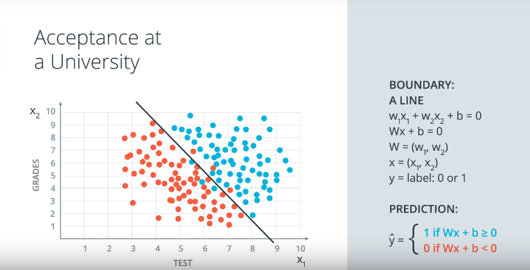
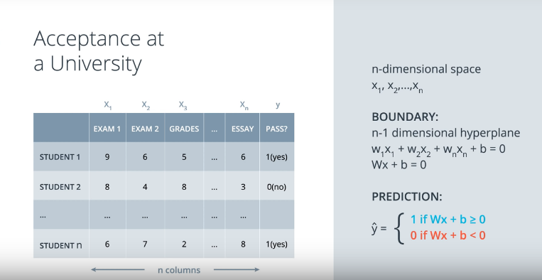

## Lesson 2: Introduction to Neural Networks

## Linear Boundaries

Example: University admissions

### Concept of separating points by a line where

~~~
w, W - represent the weights
x - points
b = bias
~~~

Essentially this is the equation of the line where we have some vectors (w1, w1) and (x1, x2) and we are trying to predict the labe of the point y whether it is a 1 or 0. (e.g. student accepted at university = 1 and student rejected = 0). Notice idea of points above and below the line, the plot is basically the graphical representation of the equation.

## Higher dimension

What if we have more data columns which means that we will work in n-dimensions? This means that our points will be separated by a plane instead of a line.

Our equation essentially remains the same, only that we add more points and weights to it. 

## Perceptron
