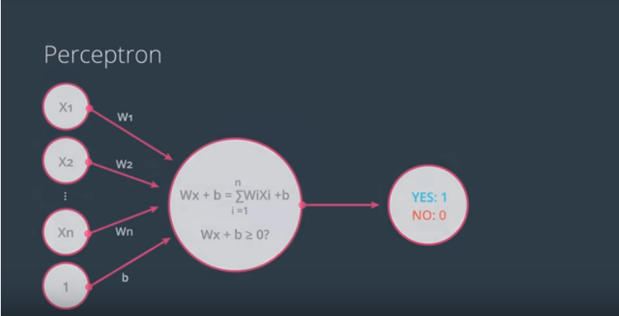
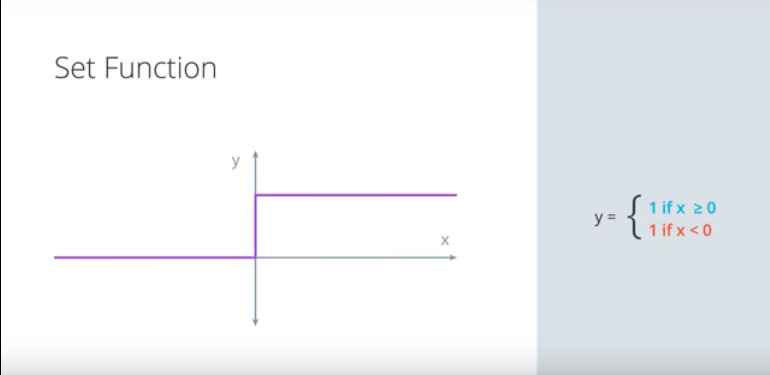
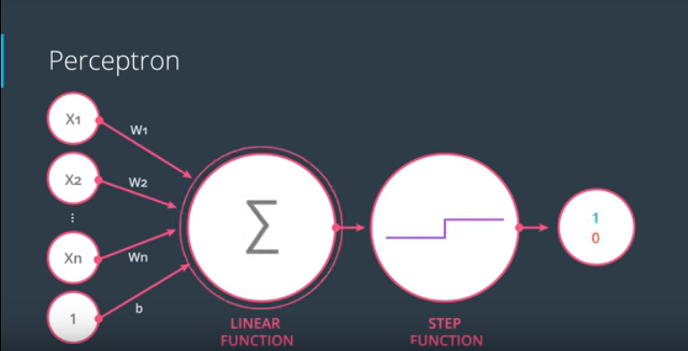
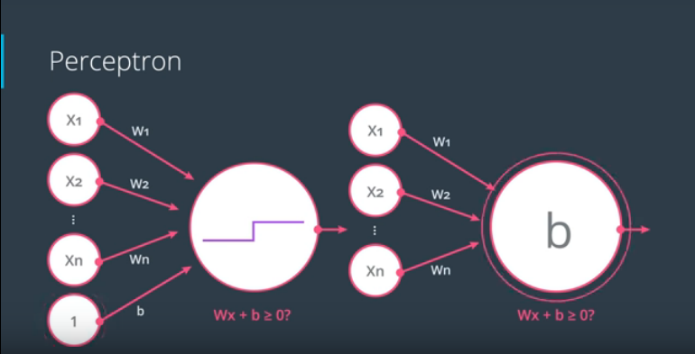

## Lesson 2: Introduction to Neural Networks

This lesson sets the theoretical foundations for the upcoming lessons.

### Table of Contents
- Linear Boundaries
- Higher dimensions
- Perceptron
	- Neural Networks
	- Perceptrons as Logical Operators

### Linear Boundaries

Example: University admissions

*Concept of separating points by a line where*
~~~
w, W - represent the weights
x - points
b = bias
~~~

Essentially this is the equation of the line where we have some vectors (w1, w1) and (x1, x2) and we are trying to predict the labe of the point y whether it is a 1 or 0. (e.g. student accepted at university = 1 and student rejected = 0). Notice idea of points above and below the line, the plot is basically the graphical representation of the equation.

### Higher dimensions

What if we have more data columns which means that we will work in n-dimensions? This means that our points will be separated by a plane instead of a line.

Our equation essentially remains the same, only that we add more points and weights to it. 

### Perceptron

The building block of neural networks. Think of the perceptron as a node that holds the linear equation that we've learned about before, an encoding of the equation into a small graph.

What the perceptron does is plot the points and check if it's in the positive and negative area. In the general case, this is how a perceptron looks like.

What is happening in the perceptron is a summation taking all the points, weights and biases following the equation that was defined ~Wx + b~. Then the node checks if the value is 0 or bigger thus returning YES or NO. 

The node uses a step function that turns everything to 1 if the output is greater than 0 and vice-versa.

As you might notice a perceptron can be seen as a combination of nodes, in this case a linear function (1st node) and a step function (2nd) that is applied to the result of the first node.

Why is this important? Because there different step functions (activation) that are used, more complex thus it's important to represent the nodes of the perceptron in such a way.

So is this the only way to represent represent the bias unit? No, we can represent it in two ways:

#### Neural Networks

What is a neural network or better, why is it called a neural network anyways? To answer that question let's imagine a perceptron and right next to it a neuron (from the brain). The reason why it's called that way is because a perceptron calculates some equation on the input and it outputs a 1 or 0. A neuron receives inputs from dendrites so the what the neuron does is process the inputs (nervous impulse) and then it decides whether it outputs a nervous impulse or not.

#### Perceptrons as Logical Operators

