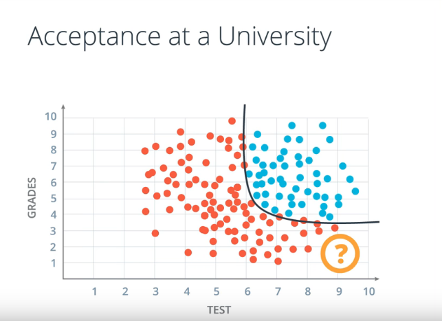

## Lesson 2: Introduction to Neural Networks

This lesson sets the theoretical foundations for the upcoming lessons.

### Table of Contents
- [Linear Boundaries](#linear-boundaries)
- [Higher dimensions](#higher-dimension)
- [Perceptron](#perceptron)
	- [Neural Networks](#neural-networks)
	- [Perceptrons as Logical Operators](#perceptrons-as-logical-operators)
	- [Perceptron Trick](#perceptron-trick)
	- [Perceptron Algorithm](#perceptron-algorithm)
- [Non-Linear Regions](#non-linear-region)
- [Error Functions](#error-functions)
	- [Log-loss error function](log-loss-error-function)


### Linear Boundaries

Example: University admissions


*Concept of separating points by a line where*
~~~
w, W - represent the weights
x - points
b = bias
~~~

Essentially this is the equation of the line where we have some vectors (w1, w1) and (x1, x2) and we are trying to predict the labe of the point y whether it is a 1 or 0. (e.g. student accepted at university = 1 and student rejected = 0). Notice idea of points above and below the line, the plot is basically the graphical representation of the equation.

### Higher dimensions

What if we have more data columns which means that we will work in n-dimensions? This means that our points will be separated by a plane instead of a line.


Our equation essentially remains the same, only that we add more points and weights to it. 

### Perceptron

The building block of neural networks. Think of the perceptron as a node that holds the linear equation that we've learned about before, an encoding of the equation into a small graph.

What the perceptron does is plot the points and check if it's in the positive and negative area. In the general case, this is how a perceptron looks like.


What is happening in the perceptron is a summation taking all the points, weights and biases following the equation that was defined as `Wx + b`. Then the node checks if the value is 0 or bigger thus returning YES or NO. 

The node uses a step function that turns everything to 1 if the output is greater than 0 and vice-versa.


As you might notice a perceptron can be seen as a combination of nodes, in this case a linear function (1st node) and a step function (2nd) that is applied to the result of the first node.


Why is this important? Because there different step functions (activation) that are used, more complex thus it's important to represent the nodes of the perceptron in such a way.

So is this the only way to represent represent the bias unit? No, we can represent it in two ways:


#### Neural Networks

What is a neural network or better, why is it called a neural network anyways? To answer that question let's imagine a perceptron and right next to it a neuron (from the brain). The reason why it's called that way is because a perceptron calculates some equation on the input and it outputs a 1 or 0. A neuron receives inputs from dendrites so the what the neuron does is process the inputs (nervous impulse) and then it decides whether it outputs a nervous impulse or not.


#### Perceptrons as Logical Operators

In the course, it has been shown that Perceptrons have the property of representing logical operators. Here is how it works, from a table we take a pair of numbers e.g. 1 and 0, these two are taken as input by the AND perceptron. Inside the perceptron imagine that the points get plotted based on their values. The result is pretty much the same as for logical operators in computer science. For AND to output True or 1 in our case, both points have to be 1 and 1 otherwise the output will be 0.


AND can be represented by the following equation `1*w1 + 1*w2 + b = 0`, where `w1 = w2 = 1 and b = -2`, in this case it means that the result is 0 thus for a linear combination it's a 1 as the output.


I've explained above how perceptrons can represent logical operators, besides the AND, there is also the OR operator, it works in a similar fashion except for the different **weights** and **bias**. 

OR can be represented as `1* x1 + 1 * x2 -1 = 0`, where `w1 = w2 = 1, and b = -1`

Let's go further and explore an aspect mentioned before. We note that OR is very similar to AND, so the question is would it be possible to go from OR to AND by adjusting the parameters? 


We could think of two ways to achieve that by **increasing the weights** or **decreasing the magnitude of the bias**.

Another operator is the NOT operator. It basically returns a 0 as output if input is 1 and returns 1 if input is 0. The other inputs are ignored by the perceptron.

Lastly, we have the XOR operator which is a combination of AND, OR, NOT operators. Essentially, an XOR returns a 1 as output if it receives two different inputs e.g. 1 and 0 => 1. 


 To have a better intuition of how the XOR works, let's build a Multi-Layered Perceptron (MLP), which basically means that we have multiple perceptrons linked together. We have all three operators learned previously AND, OR, NOT and with their help we are going to calculate an XOR. 

We have 3 perceptrons A, B, C which form the MLP. Now the question is what operators do we need in order to calculate an XOR. Let's start from the end, what input does the XOR need. For starters we would need an OR because we are interested in turning the outputs 1 and 0 into a 1 and it's just the OR does. So what can we combine it with? If you add AND and OR we will have too many of the 1s and too few 0s as input. But what if we had NOT and OR. If you think about it, we can use NOT applied to an AND in order to return 0 as ouput if input is 1 and vice-versa. Just what we needed. Take a look at the table, the first row of 1 and 1 has to be negated thus turning the output into 0, same applies for the last row which leaves us with rows 2 and 3 which we can work with because have an OR. 

Let's sort this out:
- A - AND
- B - OR
- C - NOT


#### Perceptron Trick

Imagine that we have a plot with points classified as blue and red depending on which area they are found in as in the image below. But there are there two points that look as if they don't belong. *How do we know if a point is misclassifed? If you carefully look at the color of the point (label) you can notice that they are not in correct area (color)*. Let's assume that our perceptron wasn't adjusted well enough in order to correctly the points. What can we do is make the line of the equation change, the only way we can classify correctly those points is if the line came closer to the misclassifed point eventually going over them. 


In order to grasp the math behind how the line actually moves, let's focus on an example where we have a misclassifed point. The point is telling the line to come closer. The way it works is that we can use the value of the points to subtract from the parameters of the line.


Will this solve all of our problems? We have to be careful in this case because if we drastically alter the parameters of the equation we might end up misclassifying other points. Our goal is to make the line make small steps towards the point. Enter **learning rate**.


_Note_: Depending on where the misclassified point is located we'll have to add or subtract.


What we can do with the learning rate is multiply with the points coordinates thus resulting a line equation with different parameters. The way you can think about it is a sort of factor that helps you move the position of the line. This can be applied to any of our points. Essentially, the parameters and the bias determine where the line of the equation is drawn. This is what is called as the **Perceptron Trick**. 

#### Perceptron Algorithm

We learned how the perceptron trick works conceptually and mathematically, the next goal is to learn how to implement it. 

The algorithm works this way.
```
1. Start with random initialized weights: w1, ... wn, b
2. For every misclassified point
	2.1. If point = 0 
		For i = 1...n
			Change wi + a*xi
		Change b to b+a
	2.2. If point = 1
		For i = 1...n
			Change wi - a*xi
		Change b to b-a
	Repeat until we have no errors
```

An implementation of the [perceptron](algorithms/perceptron.py) algorithm.

### Non-Linear Regions

Until now the examples we encountered had a pretty good distinction between the blue and red points. What if we receive additional scores that are different from what we got so far. 

In the image below we can noticed that our points can't be separated so well by a straight line. What do we do? Unfortunately, the perceptron algorithm will not work this time so in order to obtain for example a curved line our equation will have to be more complex. 



### Error Functions

A solution to the problem of creating a better line is going to be approached by an error function. What this means is such a function given an input is going to tell us how close the line is from the misclassified point. 

Error function = Distance, how far we are from the solution.

#### Log-loss Error function

In the course, the concept of an error function is explained by a mountain descent. Remember our goal is to minimize the error by this if you could imagine a hiker trying to descend a mountain and it's looking for the best path.  

Error tells us how far we are from the solution, in order to achieve that our error function is going to take small steps in terms of moving the line closer to the misclassified point. Broadly speaking, you could think that we are counting the number of errors and then our function (using derivatives) is taking small steps (depending on the learning rate) towards getting closer to the point, achieving the minimum solution. 

Until we get to the best solution, we might get stuck into a "valley" or better know as *local minima* which gives us the smallest error locally. This is not necessarily a bad thing but we can certainly do better.

In order for our function to work properly we have to be sure of two things:
- our function can only be continous
- our function also has to be differentiable. 

Regarding the first point, it is the case that in order to reduce the error our function has to know in which direction to go thus it is necessary that the function be continous in order to pickup the variations even if they are very small, otherwise all directions would essentially have the same value. As for the second aspect, we are going to see why it has to be differentiable later.


